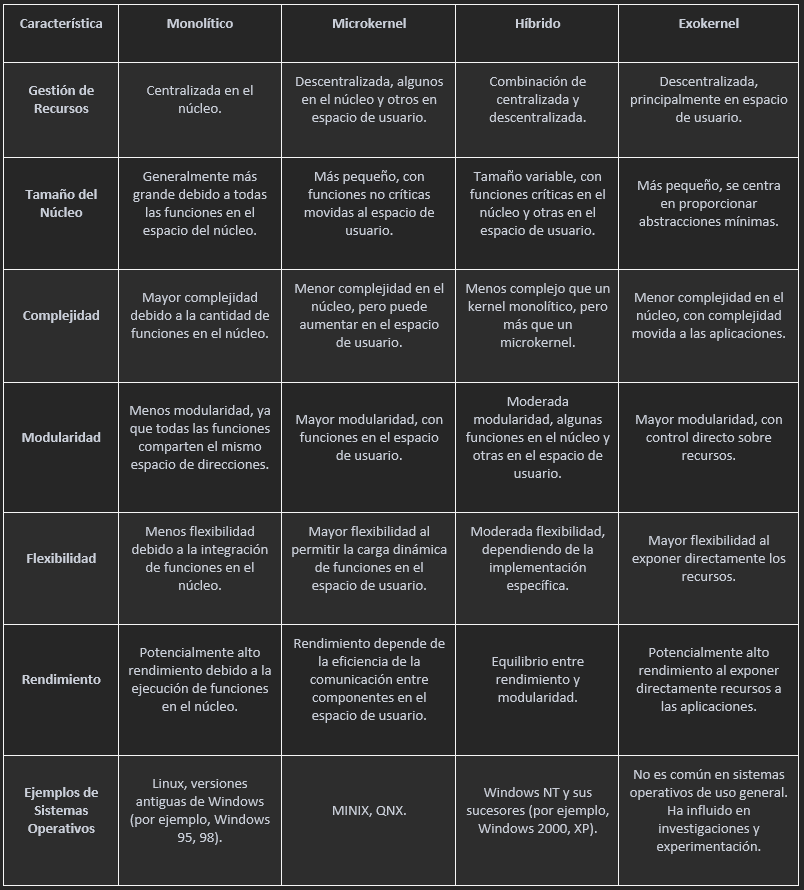

# **Tarea 1**
### Universidad de San Carlos de Guatemala
### Facultad de Ingeniería
### Escuela de Ciencias y Sistemas
### Sistemas Operativos 1
### Sección A

 

| Nombre | Carnet | 
| --- | --- |
| Jeser Emanuel Rodas Medina | 202105561 |

----

 

# Tipos de Kernel y sus diferencias
Existen diferentes tipos de kernel, que se clasifican según la forma en que gestionan los recursos del sistema. Los principales tipos de kernel son: monolítico, microkernel, híbrido y exokernel

## Monolitico
Un kernel monolítico es un tipo de diseño de núcleo de sistema operativo en el que todas las funciones del sistema operativo se ejecutan en el espacio del núcleo y comparten un solo espacio de direcciones. En este modelo, todas las partes del sistema operativo, como la gestión de procesos, la gestión de memoria, el sistema de archivos y los controladores de dispositivos, se ejecutan en modo núcleo.

A su vez, cada vez que se añada una nueva funcionalidad, deberá ser recompilado en su totalidad y luego reiniciado.

## Microkernel
Un microkernel es un diseño de núcleo de sistema operativo que busca minimizar la cantidad de código que se ejecuta en el espacio del núcleo, trasladando la mayor cantidad posible de funciones fuera del núcleo y hacia el espacio de usuario. En un microkernel, el núcleo contiene solo las funciones esenciales y críticas, como la gestión de procesos y la comunicación entre componentes. Las funciones adicionales, como controladores de dispositivos y sistemas de archivos, se ejecutan como procesos separados en el espacio de usuario.

## Híbrido
Un kernel híbrido es un tipo de diseño de núcleo de sistema operativo que combina características tanto de los kernels monolíticos como de los microkernels. En un kernel híbrido, algunas funciones esenciales se ejecutan en el espacio del núcleo, mientras que otras funciones menos críticas y controladores de dispositivos se ejecutan en el espacio de usuario como procesos separados. Este enfoque busca aprovechar las ventajas de ambos modelos para lograr un equilibrio entre eficiencia y modularidad.

## Exokernel
Un exokernel es un tipo de diseño de núcleo de sistema operativo que difiere significativamente de los modelos monolíticos y microkernels. En un exokernel, el núcleo proporciona un conjunto mínimo de abstracciones, dejando gran parte de la gestión de recursos y políticas de seguridad a las aplicaciones de usuario. La idea central es exponer directamente los recursos de hardware a las aplicaciones y permitir que estas implementen sus propias políticas de gestión de recursos.

## Tabla comparativa entre tipos de kernel

# User vs Kernel Mode

El modo usuario y el modo kernel son dos estados o niveles de privilegio en un sistema operativo que determinan el acceso y la ejecución de instrucciones en el procesador.

## Modo usuario (User mode)

En el modo usuario, los programas de aplicación y los usuarios normales ejecutan sus procesos. En este modo, el acceso a ciertos recursos del sistema operativo está restringido y se proporciona un entorno controlado para las aplicaciones. Los programas en modo usuario no tienen acceso directo a la memoria del sistema ni a instrucciones de nivel privilegiado.

Los programas en modo usuario se ejecutan con permisos limitados y no pueden realizar operaciones críticas del sistema, como modificar la tabla de paginación, cambiar configuraciones del hardware o acceder directamente a dispositivos de hardware.

## Modo kernel (Kernel mode)

El modo kernel, también conocido como modo supervisor o modo privilegiado, es un nivel más alto de privilegio en el que se ejecutan las funciones críticas del sistema operativo. En este modo, el kernel tiene acceso completo a los recursos del sistema, incluida la memoria y los dispositivos de hardware. El kernel controla las operaciones fundamentales del sistema, como la gestión de memoria, la planificación de procesos, la administración de archivos y la comunicación con dispositivos de hardware.

Solo el kernel y las partes del sistema operativo designadas pueden operar en modo kernel. Las transiciones entre el modo usuario y el modo kernel, conocidas como llamadas al sistema `(system calls)`, permiten que las aplicaciones soliciten servicios del kernel sin comprometer la seguridad y la integridad del sistema.

# Interruptions vs Traps

Las interrupciones y los traps son dos mecanismos que permiten al sistema operativo manejar situaciones especiales y garantizar un funcionamiento adecuado del sistema.

## Interrupciones (Interruptions)
Las interrupciones son eventos asincrónicos que ocurren durante la ejecución normal de un programa y requieren la atención del sistema operativo. Estas interrupciones pueden ser generadas por hardware o software y se utilizan para indicar eventos que requieren una acción inmediata.

- Interrupciones de hardware: Ocurren cuando un dispositivo externo, como un teclado o un disco duro, necesita la atención del sistema.
- Interrupciones de software: Pueden ser generadas por instrucciones especiales en el código de un programa para señalar eventos específicos que requieren manejo del sistema operativo.

Por ejemplo, cuando se presiona una tecla o se mueve el ratón, se genera una interrupción. Las interrupciones pueden ser generadas por dispositivos periféricos habilitando una señal del CPU (llamada IRQ del inglés “interrupt request”) para solicitar atención del mismo.

## Excepciones (Traps)

Las trampas, también conocidas como excepciones, son eventos sincrónicos generados por el propio programa en ejecución. A diferencia de las interrupciones, las trampas son causadas por el código del programa y suelen indicar situaciones excepcionales o errores. Los traps son eventos generados por el propio programa en ejecución. La trampa es una señal proveniente de un programa de usuario que indica que el sistema operativo debe funcionar en alguna funcionalidad inmediatamente.

Algunos ejemplos de trampas son:
- División entre cero: Ocurre cuando se intenta dividir un número entre cero.
- Acceso a memoria no permitido: Sucede cuando un programa trata de acceder a una dirección de memoria a la que no tiene permisos.

# Referencias

Ramirez, E. (2017, August 24). Tipos de kernel. Tiposde.com; Tiposde.com. https://www.tiposde.com/kernel.html

IONOS. (2021, July 5). Kernel - El núcleo del sistema operativo. IONOS Digital Guide; IONOS. https://www.ionos.es/digitalguide/servidores/know-how/que-es-el-kernel/

Kelila. (2022, October 26). Kernel monolítico - Definición y explicación. TechEdu. https://techlib.net/techedu/kernel-monolitico/

Blancarte, O. (2021). Arquitectura de Microkernel. Reactiveprogramming.io. https://reactiveprogramming.io/blog/es/estilos-arquitectonicos/microkernel‌

Marigold. (2023, June 21). Kernel híbrido - Definición y explicación. TechEdu. https://techlib.net/techedu/kernel-hibrido/

Brynne. (2022, October 26). Exokernel - Definición y explicación. TechEdu. https://techlib.net/techedu/exokernel/

Microsoft. (2023, March 8). Modo de usuario frente al modo kernel - Windows drivers. Microsoft.com. https://learn.microsoft.com/es-es/windows-hardware/drivers/audio/user-mode-versus-kernel-mode

Microsoft. (2023, December 16). Modo de usuario y modo kernel - Windows drivers. Microsoft.com. https://learn.microsoft.com/es-es/windows-hardware/drivers/gettingstarted/user-mode-and-kernel-mode

VicHaunter. (2016, May 21). ¿Qué son las interrupciones del sistema? - VicHaunter.org. VicHaunter.org. https://www.vichaunter.org/general/las-interrupciones-del-sistema

‌Interrupciones y excepciones - Wiki de Sistemas Operativos. (2019). Lsi.us.es. https://1984.lsi.us.es/wiki-ssoo/index.php/Interrupciones_y_excepciones#:~:text=Las%20excepciones%20son%20un%20tipo,valor%20usando%20como%20denominador%20cero.

‌JavaTPoint. (2021). Trap vs Interrupt in Operating System - javatpoint. Www.javatpoint.com. https://www.javatpoint.com/trap-vs-interrupt-in-operating-system

‌
‌