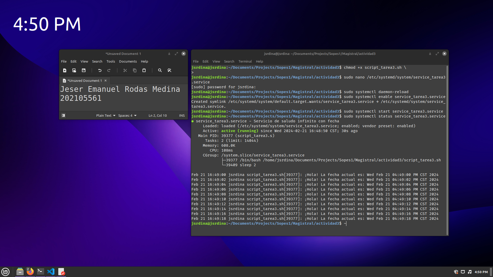

# Actividad 3

### **Nombre:** Jeser Emanuel Rodas Medina  
### **Carne:** 202105561  
### **Curso y Sección:** Sistemas Operativos (A)  
### **Universidad:** Universidad de San Carlos Guatemala  

</br>

---

</br>

# Script
Script para imprimir un saludo y la fecha actual:

```sh
#!/bin/bash
while true; do
    echo "¡Hola! La fecha actual es: $(date)"
    sleep 1
done
```

Se crea un archivo script con el contenido mostrado anteriormente. Por ejemplo, con el nombre `saludo_script.sh`

# Instalacion del servicio

## 1. Script ejecutable
Dar permisos de ejecucion al script

```sh
chmod +x saludo_script.sh
```

## 2. Crear el archivo de unidad de systemd:

Se crea un archivo de unidad systemd para el servicio. Puede nombrarse, por ejemplo, `saludo_servicio.service`

```sh
sudo nano /etc/systemd/system/saludo_servicio.service
```

Agregar el siguiente contenido al archivo:

```
[Unit]
Description=Servicio de saludo infinito con fecha

[Service]
ExecStart=/ruta/al/script/saludo_script.sh
Restart=always
User=nombre_de_usuario

[Install]
WantedBy=default.target
```

## 3. Recargar systemd
Después de crear el archivo de unidad, se recarga systemd para que reconozca los cambios:

```sh
sudo systemctl daemon-reload
```

## 4. Habilitar y comenzar el servicio
Habilitar el servicio para que se inicie con el sistema y luego iniciarlo:

```sh
sudo systemctl enable saludo_servicio.service
sudo systemctl start saludo_servicio.service
```

Ahora, el servicio debería estar en ejecución.

# Verificar servicio y ver logs.
Se puede verificar el estado del servicio con el siguiente comando:

```sh
sudo systemctl status saludo_servicio.service
```

# Detener el servicio
Para detener el servicio se puede utilizar:

```sh
sudo systemctl stop saludo_servicio.service
```

# Captura de servicio en ejecucion

