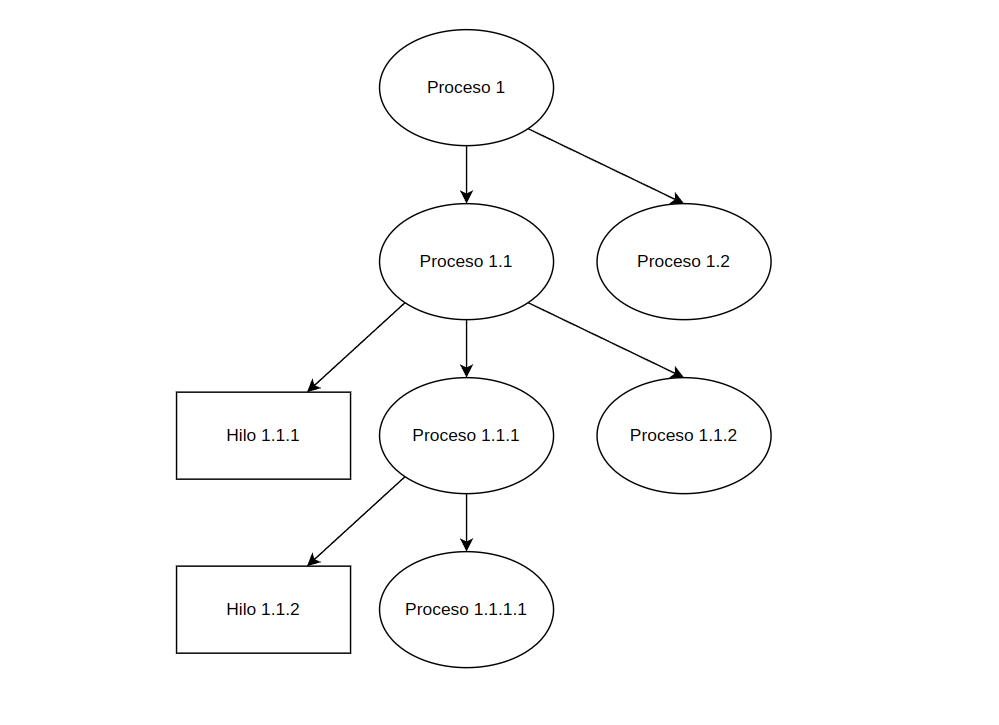

# Actividad 5

### **Nombre:** Jeser Emanuel Rodas Medina  
### **Carne:** 202105561  
### **Curso y Sección:** Sistemas Operativos (A)  
### **Universidad:** Universidad de San Carlos Guatemala  

</br>

---

</br>

## Codigo

```c   
#include <stdio.h>
#include <stdlib.h>
#include <sys/types.h>
#include <unistd.h>

int main() {
    pid_t pid;
    pid = fork();
    
    if (pid == 0) {
        fork();
        thread_create(...);
    }
    
    fork();

    return 0;
}
```

### ¿Cuántos procesos únicos son creados?
Ademas del proceso original se crean:
1. Primer proceso creado en `pid = fork();`
2. Se crea otro proceso (solo uno mas) dentro del bloque de la sentencia `if`
3. Se crean 3 procesos mas en la ultima sentencia `fork();` debido a que todos los procesos anteriores (3) lo ejecutan.

Se concluye que en total hay 6 procesos unicos.

### ¿Cuántos hilos únicos son creados?
Se crean dos hilos unicos con `thread_create()`, debido a que en la sentencia `if`, justo despues de la llamada a `fork();`, solo hay 2 procesos ejecutando esas sentencias (el primer hijo, y el hijo del hijo).


### Diagrama

